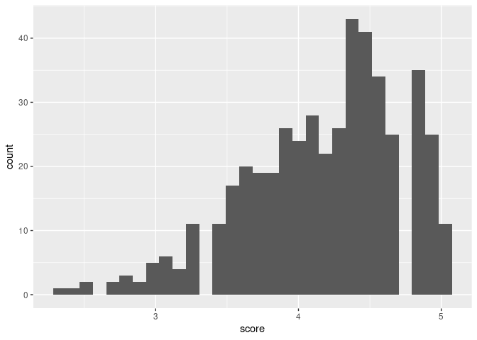
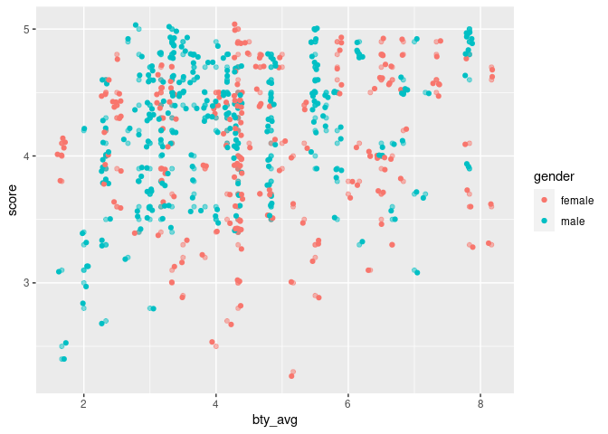
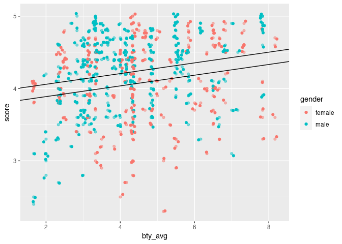

Activity 10.2 - Model Iterating
================
Bruce Buurstra

In this activity, we will continue working with the data from Activity 6
(Pivoting).

## Set-up

For this activity, you will need the `{tidyverse}` and `{broom}`
packages.

``` r
library(tidyverse)
```

    ## ── Attaching packages ─────────────────────────────────────── tidyverse 1.3.1 ──

    ## ✓ ggplot2 3.3.4     ✓ purrr   0.3.4
    ## ✓ tibble  3.1.2     ✓ dplyr   1.0.7
    ## ✓ tidyr   1.1.3     ✓ stringr 1.4.0
    ## ✓ readr   1.4.0     ✓ forcats 0.5.1

    ## ── Conflicts ────────────────────────────────────────── tidyverse_conflicts() ──
    ## x dplyr::filter() masks stats::filter()
    ## x dplyr::lag()    masks stats::lag()

``` r
library(broom)
library(readr)
```

### The data

Hamermesh and Parker gathered their data from end of semester student
evaluations for a large sample of professors from the University of
Texas at Austin. In addition, six students rated their professors’
physical appearance. Note that the data we have is a slightly modified
version of the original data set that was released as part of the
replication data for *Data Analysis Using Regression and
Multilevel/Hierarchical Models* (Gelman and Hill, 2007). The result is a
data frame where each row contains a different course and columns
represent variables about the courses and professors.

The data are stored in the repo’s `data` folder as `evals-mod.csv`.

``` r
evals <- read_csv(here::here("data", "evals-mod.csv") )
```

    ## 
    ## ── Column specification ────────────────────────────────────────────────────────
    ## cols(
    ##   score = col_double(),
    ##   rank = col_character(),
    ##   ethnicity = col_character(),
    ##   gender = col_character(),
    ##   language = col_character(),
    ##   age = col_double(),
    ##   cls_perc_eval = col_double(),
    ##   cls_did_eval = col_double(),
    ##   cls_students = col_double(),
    ##   cls_level = col_character(),
    ##   cls_profs = col_character(),
    ##   cls_credits = col_character(),
    ##   bty_f1lower = col_double(),
    ##   bty_f1upper = col_double(),
    ##   bty_f2upper = col_double(),
    ##   bty_m1lower = col_double(),
    ##   bty_m1upper = col_double(),
    ##   bty_m2upper = col_double()
    ## )

### Data codebook

| Variable name   | Description                                                                   |
|:----------------|:------------------------------------------------------------------------------|
| `score`         | Average professor evaluation score: (1) very unsatisfactory - (5) excellent   |
| `rank`          | Rank of professor: teaching, tenure track, tenure                             |
| `ethnicity`     | Ethnicity of professor: not minority, minority                                |
| `gender`        | Gender of professor: female, male                                             |
| `language`      | Language of school where professor received education: english or non-english |
| `age`           | Age of professor                                                              |
| `cls_perc_eval` | Percent of students in class who completed evaluation                         |
| `cls_did_eval`  | Number of students in class who completed evaluation                          |
| `cls_students`  | Total number of students in class                                             |
| `cls_level`     | Class level: lower, upper                                                     |
| `cls_profs`     | Number of professors teaching sections in course in sample: single, multiple  |
| `cls_credits`   | Number of credits of class: one credit (lab, PE, etc.), multi credit          |
| `bty_f1lower`   | Beauty rating of professor from lower level female: (1) lowest - (10) highest |
| `bty_f1upper`   | Beauty rating of professor from upper level female: (1) lowest - (10) highest |
| `bty_f2upper`   | Beauty rating of professor from upper level female: (1) lowest - (10) highest |
| `bty_m1lower`   | Beauty rating of professor from lower level male: (1) lowest - (10) highest   |
| `bty_m1upper`   | Beauty rating of professor from upper level male: (1) lowest - (10) highest   |
| `bty_m2upper`   | Beauty rating of professor from upper level male: (1) lowest - (10) highest   |

### Data preparation

We’ve been mostly dealing with column-wise data summaries in this class,
but there are times when we want to take information across multiple
columns and summarize this as a new value. In Activity 5.2 you did this
by using `tidyr::pivot_longer` to lengthen the data before calculating
averages by each instructor. Here we will explore the `dplyr::rowwise`
function.

Complete the code chunk below by filling in the blanks so that you
*create* a new variable called `bty_avg` that is the average
attractiveness score of the six students for each professor
(`bty_f1lower` through `bty_m2upper`) and add this new variable to the
`evals` dataset.

The [`rowwise`](https://dplyr.tidyverse.org/reference/rowwise.html)
documentation will be helpful for seeing additional examples of using
this function.

``` r
(evals <- evals %>% 
  rowwise() %>% 
  mutate(bty_avg = mean(c_across(bty_f1lower:bty_m2upper))) %>% 
  ungroup())
```

    ## # A tibble: 463 x 19
    ##    score rank       ethnicity   gender language   age cls_perc_eval cls_did_eval
    ##    <dbl> <chr>      <chr>       <chr>  <chr>    <dbl>         <dbl>        <dbl>
    ##  1   4.7 tenure tr… minority    female english     36          55.8           24
    ##  2   4.1 tenure tr… minority    female english     36          68.8           86
    ##  3   3.9 tenure tr… minority    female english     36          60.8           76
    ##  4   4.8 tenure tr… minority    female english     36          62.6           77
    ##  5   4.6 tenured    not minori… male   english     59          85             17
    ##  6   4.3 tenured    not minori… male   english     59          87.5           35
    ##  7   2.8 tenured    not minori… male   english     59          88.6           39
    ##  8   4.1 tenured    not minori… male   english     51         100             55
    ##  9   3.4 tenured    not minori… male   english     51          56.9          111
    ## 10   4.5 tenured    not minori… female english     40          87.0           40
    ## # … with 453 more rows, and 11 more variables: cls_students <dbl>,
    ## #   cls_level <chr>, cls_profs <chr>, cls_credits <chr>, bty_f1lower <dbl>,
    ## #   bty_f1upper <dbl>, bty_f2upper <dbl>, bty_m1lower <dbl>, bty_m1upper <dbl>,
    ## #   bty_m2upper <dbl>, bty_avg <dbl>

The `rowwise` function works a lot like `group_by`, except that it
groups the data frame one row at a time so that any operation applied to
the data frame is done once per each row. This is useful to calculate
the mean beauty score for each row, but we do not want to continue only
working on each row for the rest of this activity.

## Exploratory data analysis

Visualize the distribution of `score` (only). Describe this distribution
and comment on what this tells you about how students rate courses. Is
this what you expected to see? Yes Why, or why not? Typically students
like their professors more than they dont like them. Also, include any
numerical summary statistics (uses a `dplyr::summarise` pipeline, not
the `BASE::summary` function) that will help in making your response
more effective.

``` r
ggplot(data = evals, mapping = aes(score))+
  geom_histogram()
```

    ## `stat_bin()` using `bins = 30`. Pick better value with `binwidth`.

<!-- -->

``` r
summary(evals$score)
```

    ##    Min. 1st Qu.  Median    Mean 3rd Qu.    Max. 
    ##   2.300   3.800   4.300   4.175   4.600   5.000

**Response**:

A note on the `BASE::summary` function. This function along with the
`{skimr}` package provide a lot of information with just a small bit of
code. However, this is too much information (and “lazy”) when doing a
report that does not present in a human-readable table. We will shortly
see some better methods for linear model output, but you have a lot of
great `{dplyr}` skills to intentionally create great summary tables!

Visualize the distribution of `score` and the new variable that you
created, `bty_avg`. Be sure to adjust for overplotting (e.g., `alpha`
and/or jittering) Describe this distribution and comment on what this
tells you about how students rate courses. Is this what you expected to
see? Why, or why not? Also, include any numerical summary statistics
(use a `dplyr::summarise` pipeline, not the `BASE::summary` function)
that will help in making your response more effective.

``` r
ggplot(evals, aes(x = score, y = bty_avg))+
  geom_point(alpha = 0.5)+
  geom_jitter()
```

<!-- -->

**Response**:

Create a new plot that is similar to the previous plot, but also
indicates the `gender` of the professor. Describe this distribution and
comment on what this tells you about how students rate
courses/instructors. Is this what you expected to see? Why, or why not?
Also, include any numerical summary statistics (use a `dplyr::summarise`
pipeline, not the `BASE::summary` function) that will help in making
your response more effective.

``` r
ggplot(evals, aes(x = bty_avg, y = score, color = gender))+
  geom_point(alpha = 0.5)+
  geom_jitter()
```

<!-- -->

**Response**:

## Linear Models

Recall from one of your past statistics courses, that linear models take
the form:
*Y* = *β*<sub>0</sub> + *β*<sub>1</sub>*X*<sub>1</sub> + ... + *β*<sub>*k*</sub>*X*<sub>*k*</sub> + *ε*;,
if we have *k* predictors. If we have a dataset `df` that has three
variables (`y`, `x1`, and `x2`), we can fit this linear model using the
`lm` function:

    lm(y ~ x1 + x2, data = df)

Fit a linear model and assign it to `mod_bty_gender` to predict the
average professor evaluation `score` by average beauty rating
(`avg_bty`) and the professor’s `gender`.

``` r
mod_bty_gender <- lm(score ~ bty_avg + gender, data = evals)
```

Compare the output from simply running `mod_bty_gender` **and** using
the `broom::tidy` function on your model object. Based on the `tidy`
output, write the fitted linear model using appropriate variable names
and model estimates. \#score = 3.747 + 0.074*bty\_avg +
0.172*gender(0-female, 1-male) Interpret the intercept and slopes of the
linear model in the context of the data. Be sure to comment on whether
each of these values makes sense in this context. Also, use your
`{dplyr}` skills on this `tidy` output to only include the model terms,
parameter estimates, and standard errors.

``` r
mod_bty_gender
```

    ## 
    ## Call:
    ## lm(formula = score ~ bty_avg + gender, data = evals)
    ## 
    ## Coefficients:
    ## (Intercept)      bty_avg   gendermale  
    ##     3.74733      0.07415      0.17239

``` r
tidy(mod_bty_gender)
```

    ## # A tibble: 3 x 5
    ##   term        estimate std.error statistic   p.value
    ##   <chr>          <dbl>     <dbl>     <dbl>     <dbl>
    ## 1 (Intercept)   3.75      0.0847     44.3  6.23e-168
    ## 2 bty_avg       0.0742    0.0163      4.56 6.48e-  6
    ## 3 gendermale    0.172     0.0502      3.43 6.52e-  4

**Response**:

Re-plot your last visualization, but now add the linear regression
line(s) to this plot. Be sure to turn off the shading for the
uncertainty of the line.

``` r
predicted_df <- data.frame(evals_pred = predict(mod_bty_gender, evals))
ggplot(evals, aes(x = bty_avg, y = score, color = gender))+
  geom_point(alpha = 0.5)+
  geom_jitter()+
  geom_abline(intercept = 3.74, slope = 0.074)+
  geom_abline(intercept = 3.74+0.17, slope = 0.074)
```

<!-- -->

Use the `broom::glance` function to view model diagnostics.

``` r
glance(mod_bty_gender)
```

    ## # A tibble: 1 x 12
    ##   r.squared adj.r.squared sigma statistic     p.value    df logLik   AIC   BIC
    ##       <dbl>         <dbl> <dbl>     <dbl>       <dbl> <dbl>  <dbl> <dbl> <dbl>
    ## 1    0.0591        0.0550 0.529      14.5 0.000000818     2  -360.  729.  745.
    ## # … with 3 more variables: deviance <dbl>, df.residual <int>, nobs <int>

Comment on the overall fit by looking at your new visualization and
these model summary statistics.

**Response**: The overall fit is very poor.

Compare the `tidy` and `glanced` output to running
`summary(mod_bty_gender)`. I hope you noticed that with this little bit
of code, you get a lot of information. Again, I am a big believer of
being intentional about what you output (especially for reports).

## Many models

Now what we would like to do is fit similar models (i.e.,
*Y* = *β*<sub>0</sub> + *β*<sub>1</sub>*X*<sub>1</sub> + *β*<sub>2</sub>*X*<sub>2</sub> + *ε*)
to each of the instructor `rank`.

To do this, we can nest the appropriate data for each of the `rank`,
then use `map` to obtain models with similar parameters for each of the
instructor `rank`. To simplify things, we will only bring along the
information that we want to work with: `rank`, `score`, `bty_avg`, and
`gender`.

Recall from previous readings and primers that data frames/tibbles can
have columns that contain data frames/tibbles themselves. A general
nesting process to do this for a particular grouping variable is to take
the dataset, `group_by` the grouping variable, then `nest`. For example:

    nested_data <- data %>%
      group_by(grouping_variable) %>%
      nest()

Using the `evals` data,

-   *select* only the variables `rank`, `score`, `bty_avg`, and
    `gender`,
-   *group by* `ranks`,
-   *nest* the columns and rows of the other variables.

Make sure that you provide a meaningful object name. You should have a
tibble with 3 rows and two columns.

``` r
nested_data <- evals %>%
  select(rank, score, bty_avg, gender)%>%
  group_by(rank)%>%
  nest()
```

What are the two column names? rank and data Can you change the second
column’s name? If so, how?

``` r
nested_data%>%
  rename(datasets = data)
```

    ## # A tibble: 3 x 2
    ## # Groups:   rank [3]
    ##   rank         datasets          
    ##   <chr>        <list>            
    ## 1 tenure track <tibble [108 × 3]>
    ## 2 tenured      <tibble [253 × 3]>
    ## 3 teaching     <tibble [102 × 3]>

**Response**:

Now that we have the nested dataset, we can use `map` to fit a `lm` with
the same variables to each nested `data`set. In general, we could do
this like:

    nested_data %>% 
      mutate(model = map(data, ~lm(model, data = .)))

Here, `model` is the specified linear equation that we wish to fit
(e.g., `y ~ x1 + x2`).

Fit these three models to your data and *overwrite* the appropriate
object. In addition to fitting a `model` column to your, include the
following columns with the corresponding information:

-   `tidied`: a column of the model summaries of your `model` column
    (hint: `broom::tidy`),
-   `glanced`: a column of the model diagnostic summary statistics of
    your `model` column (hint: `broom::glance`), and
-   `augmented`: a column of the model residual outputs of your `model`
    column (hint: `broom::augment`).

You should have a tibble that has three rows and 6 columns (`rank`,
`data`, `model`, `tidied`, `glanced`, `augmented`).

## Many models diagnostics

Your nested dataset has a lot of information stored within it. Now we
will see how we can use this information to find insight.

The “back-transformation” to `nest`ing data is to `unnest` it. You can
`unnest` multiple columns simultaneously (see the documentation for
examples), but we will only focus on one at a time. In general, you can
unnest a column by:

    nested_data %>%
      unnest(nested_column)

`unnest` your dataset by the `tidied` column. Plot the estimated
regression coefficients for your three models (this would be a good
opportunity to use a `facet_*` layer) and provide a brief discussion
comparing these values.

**Response**:

`unnest` your dataset by the `glanced` column.. Plot the `r.squared`s
for your three models and provide a brief discussion comparing these
values and commenting on the models’ appropriateness.

**Response**:

`unnest` your dataset by the `glanced` column.. Plot the residuals
vs. fitted values provide a brief discussion commenting on the models’
appropriateness.

**Response**:

## Attribution

This activity is based on one of Mine Çetinkaya-Rundel’s [STA
199](http://www2.stat.duke.edu/courses/Spring18/Sta199/) labs.
